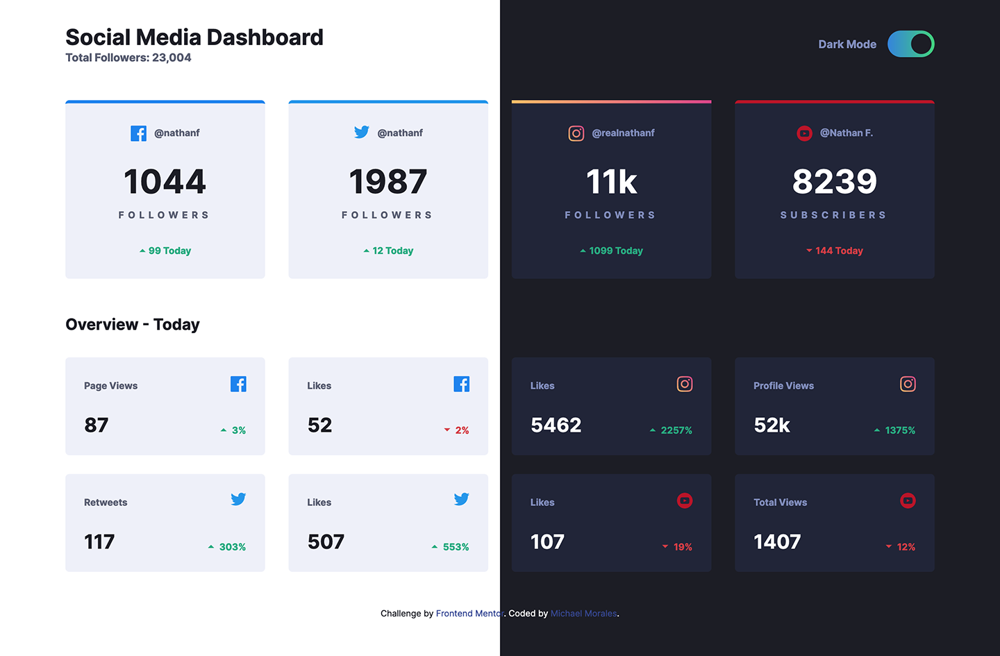

# Frontend Mentor - Social media dashboard with theme switcher solution

This is a solution to the [Social media dashboard with theme switcher challenge on Frontend Mentor](https://www.frontendmentor.io/challenges/social-media-dashboard-with-theme-switcher-6oY8ozp_H). Frontend Mentor challenges help you improve your coding skills by building realistic projects. 

## Table of contents

- [Overview](#overview)
  - [The challenge](#the-challenge)
  - [Screenshot](#screenshot)
  - [Links](#links)
- [My process](#my-process)
  - [Built with](#built-with)
  - [Useful resources](#useful-resources)
- [Author](#author)

## Overview

### The challenge

Users should be able to:

- View the optimal layout for the site depending on their device's screen size
- See hover states for all interactive elements on the page
- Toggle color theme to their preference

### Screenshot

### Links

- Solution URL: [https://github.com/J-Rayln/fem-social-media-dashboard](https://github.com/J-Rayln/fem-social-media-dashboard)
- Live Site URL: [https://j-rayln.github.io/fem-social-media-dashboard/](https://j-rayln.github.io/fem-social-media-dashboard/)

## My process

### Built with

- Semantic HTML5 markup
- CSS custom properties
- Flexbox
- CSS Grid
- Mobile-first workflow
- JavaScript
- BEM
- Gulp

### Useful resources

- Ryan Feigenbaum (24 Jun 2022)  
[The Complete Guide to Dark Mode Toggle](https://ryanfeigenbaum.com/dark-mode/)

- Ananya Neogi  
[Create A Dark/Light Mode Switch with CSS Variables](https://codepen.io/ananyaneogi/pen/zXZyMP)

## Author

- Github - [J-Ryaln](https://github.com/J-Rayln")
- Frontend Mentor - [@J-Rayln](https://www.frontendmentor.io/profile/J-Rayln)